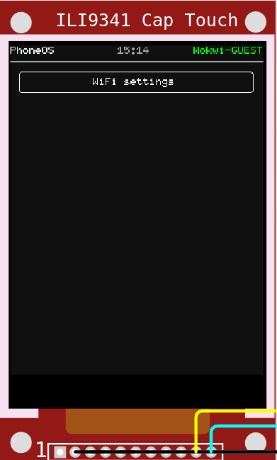
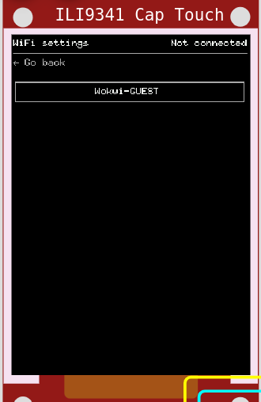

# ESP32 CYD Phone-OS

Big WIP

## Features

- Core
  - [x] Async events/UI
  - [x] Synchronized world time
  - [x] persistent storage with an SD card
  - [ ] battery percentage
- Widgets
  - [x] touch buttons
  - [x] touch keyboard
    - Layouts
      - [ ] Qwerty
      - [x] Azerty
      - [x] Symbols 1
      - [x] Symbols 2
- Apps
  - [x] app template
  - [x] wifi settings
    - [x] AP scan
    - [x] Type password
    - [x] Auto-connect to known wifis
  - [ ] Todo list
  - [ ] Clock
  - [ ] Weather
  - [ ] Messaging apps

## Hardware

- esp32 devkit C v4
  - flash size: 16Mb
  - psram size: 4Mb
- ili9341 capacitive touch (ft6206 driver)

## Apps

### Home



### Wifi settings




## Build

See `shell.nix` for needed dependencies.

```shell
cargo build
```
