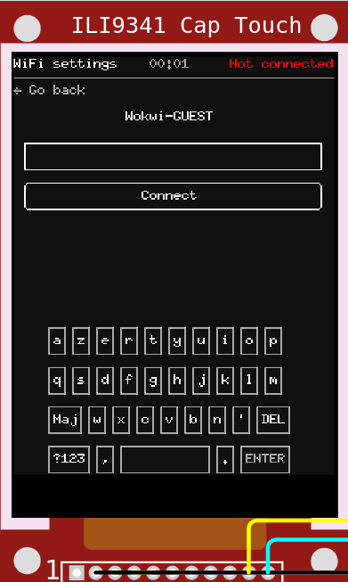

# ESP32 CYD Phone-OS

Big WIP

## Features

- [x] main interface
- [x] touch buttons
- [x] wifi
- [x] app template
- [ ] apps T_T (plz halp)

## Hardware

- esp32 devkit c
  - flash size: 16Mb
  - psram size: 4Mb
- ili9341 capacitive touch (ft6206 driver)

## Examples

Apps


Wifi settings



## Compile

```shell
export PATH="/nix/store/nwwzjfghz35xjhpxbm4g06dmibqf21gv-python3-3.12.8-env/bin/python:$PATH"
```